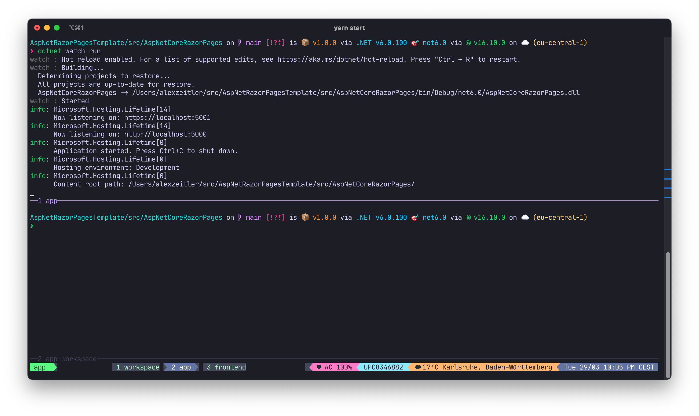
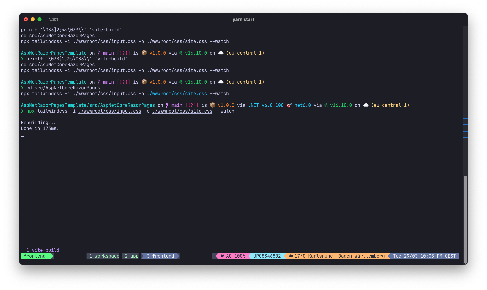
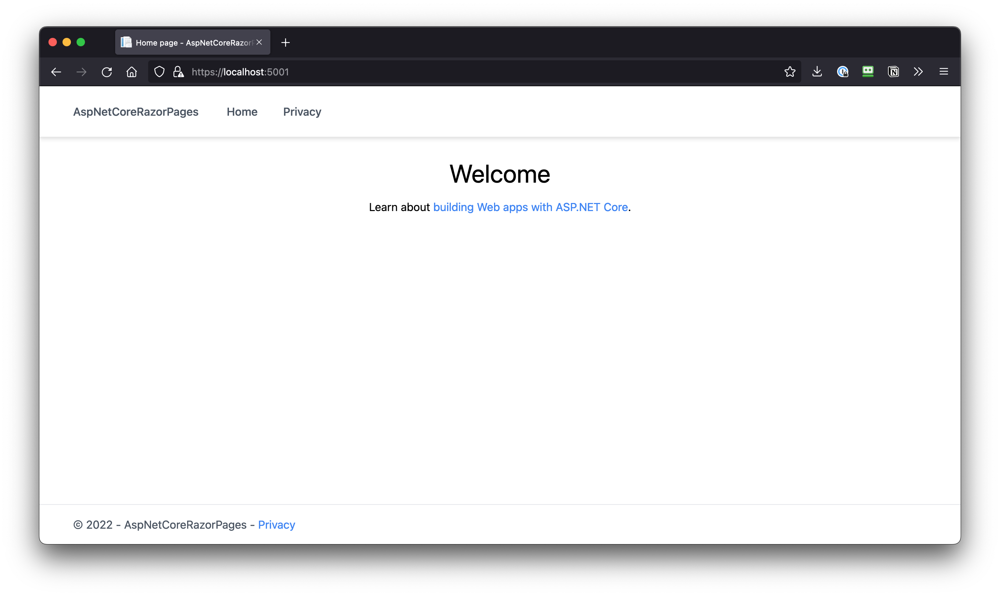

# AspNet (Core) Razor Pages Template

This is a GitHub Template for ASP.NET Core Razor Pages using .NET 6.

It contains

* a .NET Solution
* a ASP.NET Core Razor Pages project
* TailwindCSS 3 including hot reload (JIT)
* tmux/tmuxinator windows / panes for development

## Usage

### Create a new Repository

* Create a new Repository from this Template as described [here](https://docs.github.com/en/repositories/creating-and-managing-repositories/creating-a-repository-from-a-template).
* Clone your new repository locally

### Run the solution

#### First time 

```
yarn install
cd src/AspNetCoreRazorPages
yarn install
```

#### Development

```
yarn start
```

`tmuxinator` starts a new session with three windows:

##### Workspace


##### App (.NET output)


##### Frontend (tailwind build)


Browse https://localhost:5001



## Known issues

* Not tested on Windows
* JetBrains Rider code completion does not work for TailwindCSS 3 JIT mode in `.cshtml` files [currently](https://youtrack.jetbrains.com/issue/RIDER-58725).

## Renaming solution / project / folders

Of course, you want to rename the projects files to match our needs.

You can use these commands, e.g. `AspNetCoreRazorPages`  gets renamed to `MyApp`:

### Rename all references inside the files

```bash
LC_ALL=C find . -type f -name '*.*' -not \( -path './node_modules/*' -o -path './src/AspNetCoreRazorPages/node_modules/*' -o -path './assets' \) -exec sed -i '' 's|AspNetCoreRazorPages|MyApp|g' {} \;
```

### Rename files and folders

```bash
find . -depth -name "*AspNetCoreRazorPages*" | \
while IFS= read -r ent; do mv $ent ${ent%AspNetCoreRazorPages*}MyApp${ent##*AspNetCoreRazorPages}; done

```